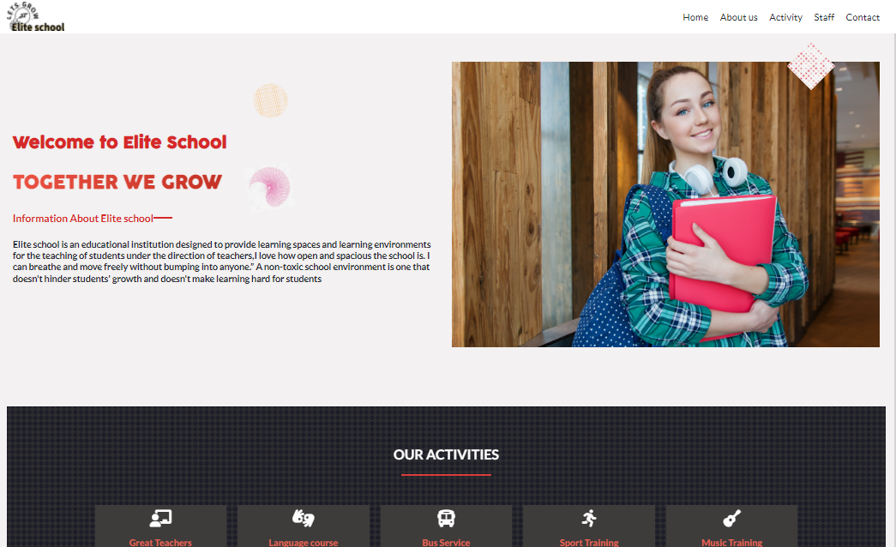
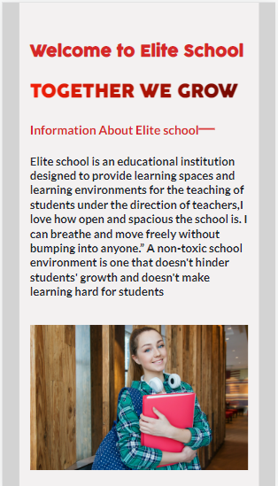

# School-Website


`Elite school` is the best school to nurture you child and enlight him/her academically.
##Desktop Version

##Mobile version

##Usage

---

```
Usage: index.html [OPTIONS]

  Securely configure your computer.
  Developed by Josphat Kiploman -> (Github: Josphat205),
(Twitter: Josphat),(Linkedin: Josphat kiploman)


Options:
  -lockdown  Set secure configuration without user interaction.
  -v         Display version and author information and exit.
  -help, -h  Show this message and exit.
```

## **Installation Options**

1. Install with [`git`](git@github.com:Josphat205/School-Website.git)

   - `$ git clone git@github.com:Josphat205/School-Website.git`

2. Download the `Elite School website` binary from Releases tab.

## **Configuration Options**

1. Firewall

   - Turn on Firewall?
     - This helps protect your Computer from being attacked over the internet.
   - Turn on logging?
     - If there IS an infection, logs are useful for determining the source.

2. General System Protection

   - Enable Gatekeeper?
     - Defend against malware by enforcing code signing and verifying downloaded applications before allowing them to run.
   - Prevent automatic software whitelisting?
     - Both built-in and downloaded software will require user approval for whitelisting.
   - Disable Captive Portal Assistant and force login through browser on untrusted networks?
     - Captive Portal Assistant could be triggered and direct you to a malicious site WITHOUT any user interaction.

3. User Safety

   - Display all file extensions?
     - This prevents malware from disguising itself as another file type.
   - Disable saving documents to the cloud by default?
     - This prevents sensitive documents from being unintentionally stored on the cloud.
   - Show hidden files in Finder?
     - This lets you see all files on the system without having to use the terminal.
   - Disable printer sharing?
     - Offers redundancy in case the Firewall was not configured.

## **How to Contribute**

1. Clone repo and create a new branch: `$ git clone git@github.com:Josphat205/School-Website.git`.
2. Make changes and test
3. Submit Pull Request with comprehensive description of changes

## **Acknowledgements**

- [@shobrook](git@github.com:Josphat205/School-Website.git) for logo and UI design assistance.
- Base logo vector made by [Freepik](https://www.freepik.com/) from [Flaticon](www.flaticon.com).

## **Donations**

This is free, open-source software. If you'd like to support the development of future projects, or say thanks for this one, you can donate BTC at `+254726831180`.
