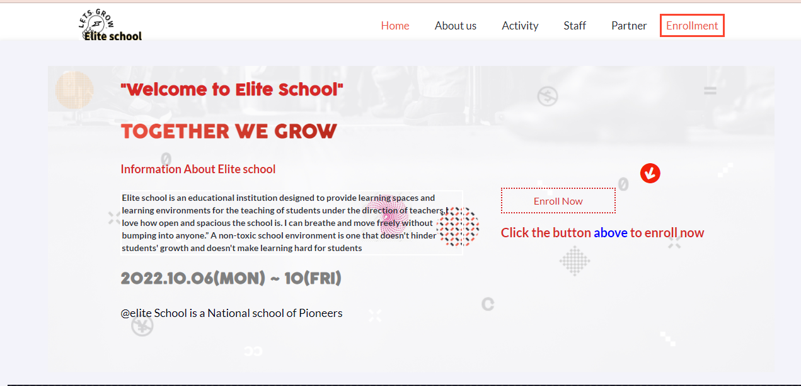
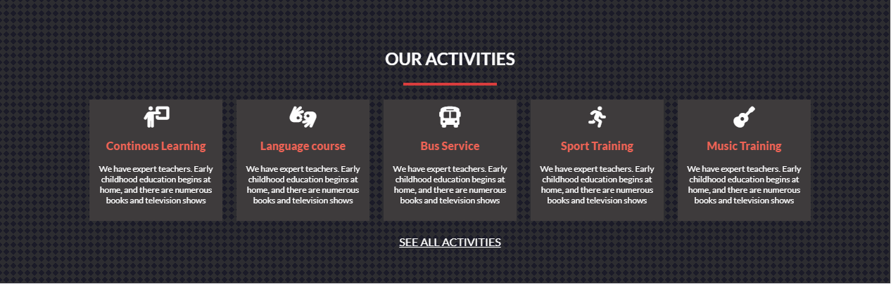
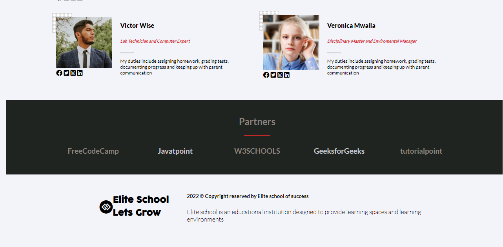
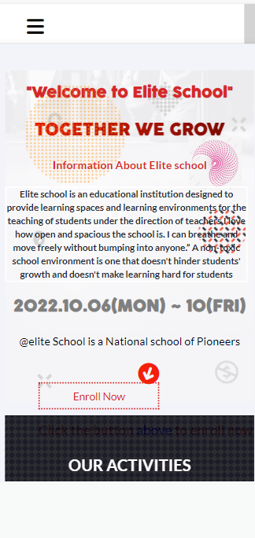
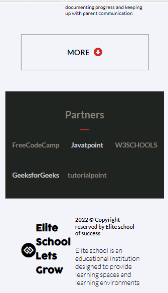

## SCHOOL-WEBSITE


`Elite school` is the best school to nurture you child and enlight him/her academically.
## Desktop Version




## Mobile version




## Usage

---

```
Usage: index.html [OPTIONS]

  Securely configure your computer.
  Developed by Josphat Kiploman -> (Github: Josphat205),
 - (Twitter: Josphat),
 - (Linkedin: Josphat kiploman)


Options:
  -lockdown  Set secure configuration without user interaction.
  -v         Display version and author information and exit.
  -help, -h  Show this message and exit.
```

## **Installation Options**

1. Install with [`git`](git@github.com:Josphat205/School-Website.git)

   - `$ git clone git@github.com:Josphat205/School-Website.git`

2. Download the `Elite School website` binary from Releases tab.

## **How to Contribute**

1. Clone repo and create a new branch: `$ git clone git@github.com:Josphat205/School-Website.git`.
2. Make changes and test
3. Submit Pull Request with comprehensive description of changes

## **Acknowledgements**

- [@Josphat205](git@github.com:Josphat205/School-Website.git) for logo and UI design assistance.
- Base logo vector made by [@Josphat37023781](https://www.twitter.com/) from [josphat kiploman](www.linkedin.com).

## **Donations**

This is free, open-source software. If you'd like to support the development of future projects, or say thanks for this one, you can donate BTC to `+254726831180`.
